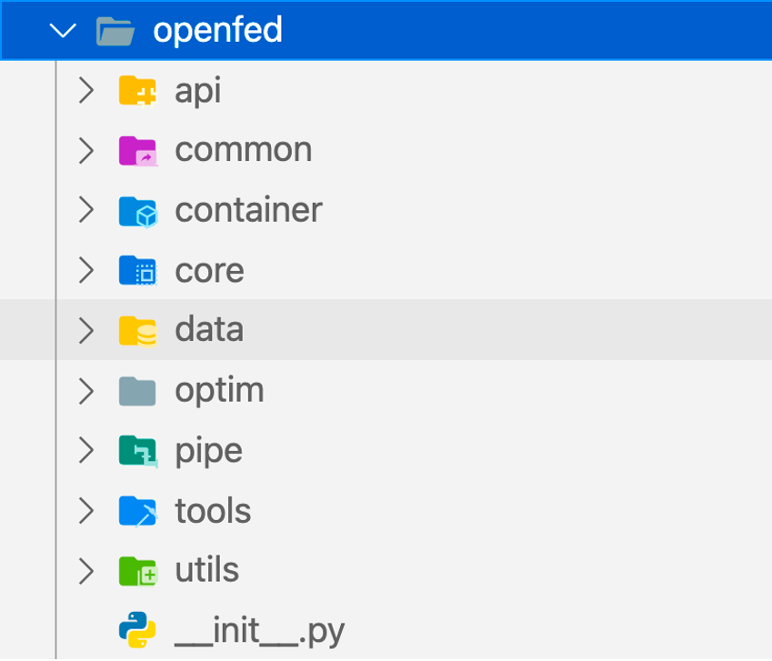

# OpenFed

## Features

1. Async/Sync Transfer Support
2. Dynamic Address Management
3. Unified Frontend and Backend API
4. Arbitrary Federated Topology Connection
5. Transfer Data without Hesitation
6. PyTorch Coding Style

## Install

Python>=3.7, PyTorch=1.9.0 are required.

```bash
pip install openfed # not the latest version.
```

```bash
conda create -n openfed python=3.7 -y
conda activate openfed
pip3 install -r requirements.txt

# test
python3 -m openfed.launch --nproc_per_node 3 --logdir /tmp --server_output demo.py

# make sure /tmp/openfed.sharefile does not exist before run this script.
python3 -m openfed.launch --nproc_per_node 11 --logdir /tmp --server_output demo.py --init_method file:///tmp/openfed.sharefile
```

## Docs

```bash
# install requirements
pip install Sphinx
pip install sphinx_rtd_theme

# install openfed to your python path
python setup.py install

cd docs
# generate rst files
sphinx-apidoc -o . ../openfed/

# make html
make html

# docs have been generated under 'docs/_build/html'
```

## Build Federated Learning in an Unprecedented Simple Way

```python
import random

import torch
import torch.nn as nn
import torch.optim as optim

# >>> Import OpenFed
import openfed
import openfed.aggregate as aggregate
from openfed.unified.step import StepAt
from openfed.utils import time_string

# >>> set log level
openfed.logger.log_level(level="INFO")

# >>> Get default arguments from OpenFed
args = openfed.parser.parse_args()

# >>> Specify an API for building federated learning
openfed_api = openfed.API(frontend=args.rank > 0)

# >>> Specify a aggregate trigger
# It means that every 10 received models will make an aggregate operation.
aggregate_trigger = openfed.AggregateCount(
    count=2, checkpoint="/tmp/openfed-model")

# >>> Set the aggregate trigger
openfed_api.set_aggregate_triggers(aggregate_trigger)

# >>> Register more step functions.
# You can register a step function to openfed_api like following:
# stop_at_version = openfed.StopAtVersion(max_version=10)
# openfed_api.register_step(stop_at_version)
# Or use the with context to add a sequence of step function to openfed_api automatically.
with StepAt(openfed_api):
    openfed.StopAtVersion(max_version=3)

# >>> Connect to Address.
openfed_api.build_connection(address=openfed.Address(args=args))

# Build Network
net = nn.Linear(1, 1)

# Define optimizer (use the same optimizer in both server and client)
optimizer = optim.SGD(net.parameters(), lr=0.1, momentum=0.9)

# Define aggregator (actually, this is only used for server end): FedAvg, ElasticAggregator
aggregator = aggregate.AverageAggregator(net.parameters())

# >>> Set optimizer and aggregator for federated learning.
openfed_api.set_aggregator_and_optimizer(aggregator, optimizer)

# >>> Tell OpenFed API which data should be transferred.
openfed_api.set_state_dict(net.state_dict(keep_vars=True))

# Context `with openfed_api` will go into the specified settings about openfed_api.
# Otherwise, will use the default one which shared by global OpenFed world.
with openfed_api:

    # >>> If openfed_api is a backend, call `run()` will go into the loop ring.
    # >>> Call `start()` will run it as a thread.
    # >>> If openfed_api is a frontend, call `run()` will directly skip this function automatically.
    openfed_api.run()

    # Do simulation random times at [10, 70].
    for i in range(1, random.randint(10, 70)):
        print(f"{time_string()}: Simulation @{i}")

        # Download latest model.
        print(f"{time_string()}: Downloading latest model from server.")
        if not openfed_api.download():
            print(f"Downloading failed.")
            break

        # Downloaded
        print(f"{time_string()}: Downloaded!")

        # Start a standard forward/backward pass.
        optimizer.zero_grad()
        net(torch.randn(128, 1, 1)).sum().backward()
        optimizer.step()

        # Upload trained model
        print(f"{time_string()}: Uploading trained model to server.")
        if not openfed_api.upload():
            print("Uploading failed.")
            break
        print(f"{time_string()}: Uploaded!")

        # >>> Update inner model version
        openfed_api.update_version()

# >>> Finished
openfed_api.finish()

print(f"Finished.\nExit Client @{openfed_api.nick_name}.")
```

### Backend

```bash
(openfed) python demo.py --rank 0 --world_size 3
[W ProcessGroupGloo.cpp:684] Warning: Unable to resolve hostname to a (local) address. Using the loopback address as fallback. Manually set the network interface to bind to with GLOO_SOCKET_IFNAME. (function operator())
2021-06-29 10:08:48.136 | INFO     | openfed.unified.step.after_download:__call__:27 - Receive @1
From <OpenFed> Reign
mixture

2021-06-29 10:08:48.139 | WARNING  | openfed.unified.step.before_upload:__call__:15 - Version not aligned. (request @1, but @0).
2021-06-29 10:08:48.142 | INFO     | openfed.unified.step.after_download:__call__:27 - Receive @2
From <OpenFed> Reign
blinks

2021-06-29 10:08:48.142 | INFO     | openfed.unified.step.at_last:__call__:94 - Aggregate operation triggered by count.
2021-06-29 10:08:48.159 | INFO     | openfed.unified.step.after_download:__call__:27 - Receive @1
From <OpenFed> Reign
mixture

2021-06-29 10:08:48.163 | WARNING  | openfed.unified.step.before_upload:__call__:15 - Version not aligned. (request @2, but @1).
2021-06-29 10:08:48.169 | INFO     | openfed.unified.step.after_download:__call__:27 - Receive @2
From <OpenFed> Reign
blinks

2021-06-29 10:08:48.170 | INFO     | openfed.unified.step.at_last:__call__:94 - Aggregate operation triggered by count.
2021-06-29 10:08:48.193 | INFO     | openfed.unified.step.after_download:__call__:27 - Receive @1
From <OpenFed> Reign
mixture

2021-06-29 10:08:48.197 | WARNING  | openfed.unified.step.before_upload:__call__:15 - Version not aligned. (request @3, but @2).
2021-06-29 10:08:48.201 | INFO     | openfed.unified.step.after_download:__call__:27 - Receive @2
From <OpenFed> Reign
blinks

2021-06-29 10:08:48.201 | INFO     | openfed.unified.step.at_last:__call__:94 - Aggregate operation triggered by count.
2021-06-29 10:08:48.204 | INFO     | openfed.unified.unify:finish:83 - Finished.
 <OpenFed> OpenFed Unified API
<OpenFed> Maintainer
+---------+----------+---------+
| Pending | Finished | Discard |
+---------+----------+---------+
|    0    |    1     |    0    |
+---------+----------+---------+
```

### Frontend-1

```bash
(openfed) python demo.py --rank 1 --world_size 3
[W ProcessGroupGloo.cpp:684] Warning: Unable to resolve hostname to a (local) address. Using the loopback address as fallback. Manually set the network interface to bind to with GLOO_SOCKET_IFNAME. (function operator())
2021-06-29 10:08:43: Simulation @1
2021-06-29 10:08:43: Downloading latest model from server.
2021-06-29 10:08:48: Downloaded!
2021-06-29 10:08:48: Uploading trained model to server.
2021-06-29 10:08:48: Uploaded!
2021-06-29 10:08:48: Simulation @2
2021-06-29 10:08:48: Downloading latest model from server.
2021-06-29 10:08:48: Downloaded!
2021-06-29 10:08:48: Uploading trained model to server.
2021-06-29 10:08:48: Uploaded!
2021-06-29 10:08:48: Simulation @3
2021-06-29 10:08:48: Downloading latest model from server.
2021-06-29 10:08:48: Downloaded!
2021-06-29 10:08:48: Uploading trained model to server.
2021-06-29 10:08:48: Uploaded!
2021-06-29 10:08:48: Simulation @4
2021-06-29 10:08:48: Downloading latest model from server.
Downloading failed.
Finished.
Exit Client @mixture.
```

### Frontend-2

```bash
(openfed) python demo.py --rank 2 --world_size 3
[W ProcessGroupGloo.cpp:684] Warning: Unable to resolve hostname to a (local) address. Using the loopback address as fallback. Manually set the network interface to bind to with GLOO_SOCKET_IFNAME. (function operator())
2021-06-29 10:08:43: Simulation @1
2021-06-29 10:08:43: Downloading latest model from server.
2021-06-29 10:08:48: Downloaded!
2021-06-29 10:08:48: Uploading trained model to server.
2021-06-29 10:08:48: Uploaded!
2021-06-29 10:08:48: Simulation @2
2021-06-29 10:08:48: Downloading latest model from server.
2021-06-29 10:08:48: Downloaded!
2021-06-29 10:08:48: Uploading trained model to server.
2021-06-29 10:08:48: Uploaded!
2021-06-29 10:08:48: Simulation @3
2021-06-29 10:08:48: Downloading latest model from server.
2021-06-29 10:08:48: Downloaded!
2021-06-29 10:08:48: Uploading trained model to server.
2021-06-29 10:08:48: Uploaded!
2021-06-29 10:08:48: Simulation @4
2021-06-29 10:08:48: Downloading latest model from server.
Downloading failed.
Finished.
Exit Client @blinks.
```

## Project Structure

<div align=center>

</div>