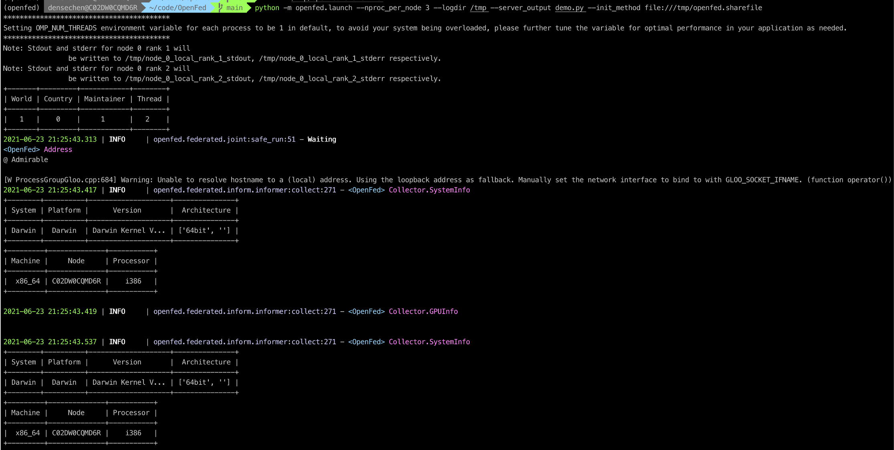

# OpenFed

## 创建一个只有单一客户端和服务器的联邦学习环境




## 文件结构

```bash
openfed
├── __init__.py
├── aggregate
│   ├── __init__.py
│   ├── aggregator.py
│   ├── average.py
│   ├── elastic.py
│   └── naive.py
├── backend.py
├── common
│   ├── __init__.py
│   ├── address.py
│   ├── array.py
│   ├── constants.py
│   ├── hook.py
│   ├── logging.py
│   ├── package.py
│   ├── peeper.py
│   ├── thread.py
│   ├── vars.py
│   └── wrapper.py
├── data
│   ├── __init__.py
│   ├── dataset.py
│   ├── nlp
│   │   ├── __init__.py
│   │   ├── shakespear.py
│   │   └── stackoverflow.py
│   ├── partitioner.py
│   └── vision
│       ├── __init__.py
│       └── emnist.py
├── federated
│   ├── __init__.py
│   ├── core.py
│   ├── deliver
│   │   ├── __init__.py
│   │   ├── __pycache__
│   │   ├── delivery.py
│   │   └── functional.py
│   ├── country.py
│   └── inform
│       ├── __init__.py
│       ├── functional.py
│       └── informer.py
├── frontend.py
├── launch.py
├── optim
│   ├── __init__.py
│   └── elastic_aux.py
└── utils
    ├── __init__.py
    ├── helper.py
    └── utils.py

11 directories, 42 files
```