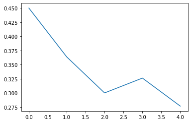

Paillier Crypto
===============

Load Public Key
---------------

.. code:: ipython3

    import os
    from openfed.functional import PublicKey
    
    if not os.path.isfile('/tmp/public.key'):
        raise FileNotFoundError(
            "Public Key is not found. Generate it using the `paillier_crypto_server` script."
        )
    else:
        public_key = PublicKey.load('/tmp/public.key')
        print("Load public key from /tmp/public.key")
    print(public_key)

.. parsed-literal::

    Load public key from /tmp/public.key
    <OpenFed> PublicKey
    +-------+------+-----------+----+-------+------------+------------+
    | n_lwe | bits | bits_safe | l  | bound |     p      |     q      |
    +-------+------+-----------+----+-------+------------+------------+
    |  3000 |  32  |     24    | 64 |   8   | 4294967297 | 4294967296 |
    +-------+------+-----------+----+-------+------------+------------+
    

Download Dataset
----------------

.. code:: ipython3

    from openfed.data import IIDPartitioner, PartitionerDataset
    from torchvision.datasets import MNIST
    from torchvision.transforms import ToTensor
    
    dataset = PartitionerDataset(
        MNIST(r'/tmp/', True, ToTensor(), download=True), total_parts=10, partitioner=IIDPartitioner())

Dataloader
----------

.. code:: ipython3

    from torch.utils.data import DataLoader
    
    dataloader = DataLoader(dataset, batch_size=10, shuffle=True, num_workers=0, drop_last=False)

Network
-------

.. code:: ipython3

    import torch.nn as nn
    
    network = nn.Linear(784, 10)
    loss_fn = nn.CrossEntropyLoss()

Optimizer
---------

.. code:: ipython3

    import torch
    from openfed.federated import collaborator
    from openfed.optim import FederatedOptimizer
    
    optim = torch.optim.SGD(network.parameters(), lr=0.1)
    fed_optim = FederatedOptimizer(optim, role=collaborator)
    
    print(fed_optim)

.. parsed-literal::

    <OpenFed> FederatedOptimizer
    SGD (
    Parameter Group 0
        dampening: 0
        lr: 0.1
        momentum: 0
        nesterov: False
        weight_decay: 0
    )
    

Topology
--------

.. code:: ipython3

    import openfed
    from openfed.topo import Node, Topology, analysis
    
    server_node = Node('server', openfed.default_tcp_address)
    client = Node('client', openfed.empty_address)
    
    topology = Topology()
    topology.add_edge(client, server_node)
    
    fed_props = analysis(topology, client)[0]
    
    print(fed_props)

.. parsed-literal::

    <OpenFed> FederatedProperties
    +------------------+-----------+
    |       role       | nick_name |
    +------------------+-----------+
    | openfed_collaborator |   client  |
    +------------------+-----------+
    <OpenFed> Address
    +---------+---------------------+------------+------+
    | backend |     init_method     | world_size | rank |
    +---------+---------------------+------------+------+
    |   gloo  | tcp://localhost:... |     2      |  1   |
    +---------+---------------------+------------+------+
    
    

Maintainer
----------

.. code:: ipython3

    from openfed.core import Maintainer
    
    mt = Maintainer(fed_props, network.state_dict(keep_vars=True))
    
    print(mt)
    
    with mt:
        openfed.F.paillier(public_key)

.. parsed-literal::

    <OpenFed> Maintainer
    +------------------+-----------+-------+
    |       role       | nick_name | pipes |
    +------------------+-----------+-------+
    | openfed_collaborator |   client  |   1   |
    +------------------+-----------+-------+
    

Step
----

.. code:: ipython3

    
    import random
    import time
    
    version = 0
    outter_losses = []
    for outter in range(5):
        outter_loss = []
        for inner in range(2):
            mt.update_version(version)
            mt.step(upload=False)
    
            part_id = random.randint(0, 9)
            print(f"Select part_id={part_id}")
            dataset.set_part_id(part_id)
    
            network.train()
            losses = []
            tic = time.time()
            for data in dataloader:
                x, y = data
                output = network(x.view(-1, 784))
                loss = loss_fn(output, y)
    
                fed_optim.zero_grad()
                loss.backward()
                fed_optim.step()
                losses.append(loss.item())
            toc = time.time()
            loss = sum(losses) / len(losses)
            outter_loss.append(loss)
            duration = toc - tic
    
            fed_optim.round()
    
            mt.update_version(version + 1)
            mt.package(fed_optim)
            mt.step(download=False)
            fed_optim.clear_state_dict()
    
            print(
                f"Outter: {outter}, Inner: {inner}, version: {version}, loss: {loss:.2f}, duration: {duration:.2f}"
            )
    
        version += 1
        outter_losses.append(sum(outter_loss) / len(outter_loss))

.. parsed-literal::

    Select part_id=9
    Outter: 0, Inner: 0, version: 0, loss: 0.49, duration: 0.79
    Select part_id=8
    Outter: 0, Inner: 1, version: 0, loss: 0.41, duration: 0.75
    Select part_id=4
    Outter: 1, Inner: 0, version: 1, loss: 0.36, duration: 0.71
    Select part_id=6
    Outter: 1, Inner: 1, version: 1, loss: 0.36, duration: 0.79
    Select part_id=9
    Outter: 2, Inner: 0, version: 2, loss: 0.26, duration: 0.75
    Select part_id=8
    Outter: 2, Inner: 1, version: 2, loss: 0.34, duration: 0.66
    Select part_id=7
    Outter: 3, Inner: 0, version: 3, loss: 0.34, duration: 0.70
    Select part_id=8
    Outter: 3, Inner: 1, version: 3, loss: 0.31, duration: 0.78
    Select part_id=4
    Outter: 4, Inner: 0, version: 4, loss: 0.31, duration: 0.75
    Select part_id=9
    Outter: 4, Inner: 1, version: 4, loss: 0.24, duration: 0.71

Loss
----

.. code:: ipython3

    %matplotlib inline
    
    import matplotlib.pyplot as plt
    
    plt.figure()
    plt.plot(outter_losses)
    plt.show()

